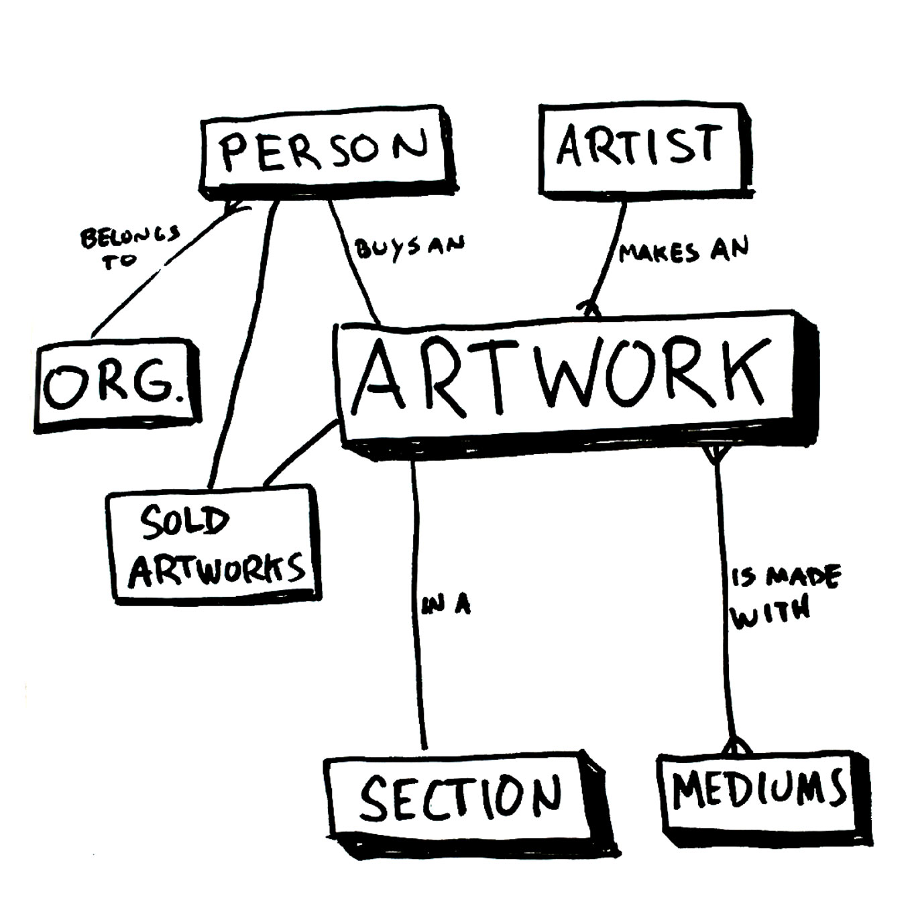

# Design Document

## Art-Base-One

By Nick Golebiewski

Video overview: <URL HERE>

## Scope

This is a database for professional visual artists to track their artworks, sales, and contacts, exapandable for use by galleries and even museums. Personal note: I am switching careers from being a freelance visua artist to a software engineer, and will use this database to better access my 5,000+ artworks. 

This project takes inspiration from the Metropolitan Museum of Art's Public API for their artwork database (for organizing information about an individual artwork) with a touch of Etsy's sales capabilities. Included in the artwork's scope is:

* Artists: Name, bio, image (there may be collaborators on an artwork, or if used by a gallery, a way to organize multiple artists' works).
* Artworks: A record for each individual artwork, i.e. a painting or a film.
* Mediums: The material(s) used to create an artwork, i.e. watercolor, paper, pen & ink.
* Sections: Ways to categorize artworks. 
    * Departments are imilar to department at the Met Museum and the largest umbrella such as Film, Painting, Drawing.
    * Series: A more granular unit of categorization. The series of work an artwork belongs to. i.e. Drawing-a-day project, Storefront paintings, The Blue Period, etc.
* Persons: Those who collect, express interest in artwork, studio contacts, or hire.
* Organizations: For example, the organization a person belongs to that collected an artwork.
* Sold Artworks: Keeps track of sold artworks. 
* OUTSIDE THE CURRENT SCOPE: 
    * Payment system.
    * fine art prints (reproductions of artworks for sale) inventory, 
    * methods for importing data from Instagram (user doata download in JSON format) into the artworks table. 
    *  Projects, when a person hires the artist, info on project can be tracked via this and used for invoicing, etc. 
    * Alternate Images: Allows for multiple images of an artwork.

## Functional Requirements

This database will support:

* CRUD operations for artists, artworks and people (contacts/collectors/clients)
* Tracking artworks, artwork availaibility and artwork sales. 
* This system won't support fine art print sales at the moment, client project tracking, nor adding in artist collaborators on a single artwork.

## Representation

Entities are captured in SQLite tables and an image folder with the following schema.

### Entities

The database includes the following entities:

#### Artists

The `artists` table includes:

* `id`, represents a unique ID for the artist as an `INTEGER`. This column has the `PRIMARY KEY` constraint applied.
* `first_name`, represents the first name of the artist as `TEXT`, which is a data type that can represent a name made up of letter characters.  If first name is unknown use 'unknown' 
* `last_name`, represents the artist's last nameas `TEXT`, which is a data type that can represent a name made up of letter characters. If last name is unknown use 'unknown' 
* `artist_name`, `NULLABLE/OPTIONAL`similar to `first_name` and `last_name`. This is an optional field, because only some artists use a nom de plume or another artist name. i.e. Prince. 
* `short_bio`, short biography of the artist. Used for websites or a quick summary. Represent as `TEXT` since this is made up of sentences. 
* `long_bio`, `NULLABLE/OPTIONAL` longer version of `short_bio` as `TEXT`. OPTIONAL, Sometimes `short_bio` is all that is needed or is unknown. 
* `pic`, I'm interested in saving this as a `BLOB` with a file size limit, a bio pic, of the. Elsewhere I will save a URL pointing to an image. 
* `birth_year`, year the artist was born, common information shared on artist curriculum vitae's and in museum records. `INTEGER` to represent the year i.e. 2024.
* `birth_country`, country the artist was born in, like `birth_year`, a commonly used artist identifier. `TEXT` because this is the name of a country.
* `death_year`, `NULLABLE/OPTIONAL` could be alive. `INTEGER` to represent the year i.e. 2024.

#### Artworks

The `artworks` table includes:

* `id`, represents a unique ID for the artwork as an `INTEGER`. This column has the `PRIMARY KEY` constraint applied.
* `artist`, represents the id of the artist that made the artwork as an `INTEGER`. This column has the `FOREIGN KEY` constraint applied. Note: for artworks with an unkown artist, use the `Unknown`
* `title`, title of artwok as `TEXT`.
* `size`, size of artwok as `TEXT`, i.e. 8" x 10" (" = inches).
* `year`, year artwork was made as `INTEGER`.
* NOTE: `mediums` via a `JOIN TABLE` as can be multiple media types i.e. watercolor, pen & ink, pencil all on the same artowrk. Therefore not 
* `image_url`, `TEXT` field that is a Uniform Resource Locator link poitning to the main image file of the artwork. 
* `description`, `TEXT` describes artwork, or any notes that should be displayed along with the image.
* `department`, borrowing this classifier from the Met Museum, to link to another table with each main classifier of an artwork, such as 'painting' or 'film' or 'photography', as a top level taxonomy, as opposed to the multiple possibilities of `media`. Represent as an `INTEGER` with the `FOREIGN KEY` constraint applied.
* `series`, like `department`, can put an artwork within a `series` for classifying with an end use to produce useful sections on a website. For example, Picasso's blue period is a series, or for me, "Chinatown Paintings" or "Drawing-a-Day". Limit to one series. Represent as an `INTEGER` with the `FOREIGN KEY` constraint applied.
* `sold`, boolean True/False, represented as an `INTEGER`, 0/1. Will connect to a buyer table. 
* `price`, `OPTIONAL/NULLABLE`, `NUMERIC` to allow for decimal points in currency. Reflects the price of the artwork. Can be optional if work is not for sale.

LIMITATION: Add a join table and an images table for additional images so an artwork can have multiple photos associated with it. i.e. a closeup, or on a gallery wall.

IN A LATER EDITION:
* `additional_artist`, `NULLABLE/OPTIONAL`, For collaborators on an artwork to be represented as an `INTEGER` connecting to the artist `id`. NOTE: In a future version use a join table to create the option for multiple collaborators. Choosing not to add that in now as it would be a needless complication for querying the artists of an artwork. Add to a later version of database.

#### Mediums

The `mediums` table includes:

* `id`, represents a unique ID for each medium as an `INTEGER`. This column has the `PRIMARY KEY` constraint applied.
* `name`, represents the name of the medium, which is defined as the material(s) used to make the artwork, i.e. 'watercolor', 'oil paint' or 'intaglio' as `TEXT`. `UNIQUE` constraint applied as there should only be one of each medium.
* `description`, represents a description of the medium as `TEXT`, for example to define or describe what 'intaglio' is, which is an engraving printmaking technique.

#### Artwork_Mediums

The `artwork_mediums` join table includes:

* `artwork_id`, represents the artwork id as an `INTEGER` with a `FOREIGN KEY` constraint applied. An artwork can have multiple mediums.
* `medium_id`, represents the medium id as an `INTEGER` with a `FOREIGN KEY` constraint applied. A medium can be used on multiple artworks.

#### Series

The `series` table includes:

* `id`, represents a unique ID for each medium as an `INTEGER`. This column has the `PRIMARY KEY` constraint applied.
* `name`, represents the name of the series an artwork belongs to, i.e. the 'Blue Period' or 'Storefront Paintings' as `TEXT`. The user can define multiple series, rather than defining it as finite set of enums in the `artworks` table, `UNIQUE` constraint applied as there should only be one of each series.
* `description`, represents a description of the `series` in `TEXT`, for example to provide context and further information for the user. Picasso's Blue Period could be defined as: 

        "The Blue Period (Spanish: Período Azul) comprises the works produced by Spanish painter Pablo Picasso between 1901 and 1904. During this time, Picasso painted essentially monochromatic paintings in shades of blue and blue-green, only occasionally warmed by other colors. These sombre works, inspired by Spain and painted in Barcelona and Paris, are now some of his most popular works, although he had difficulty selling them at the time."  (from Wikipedia) https://en.wikipedia.org/wiki/Picasso%27s_Blue_Period

#### Persons

The `persons` table includes:

* `id`, represents a unique ID for the artist as an `INTEGER`. This column has the `PRIMARY KEY` constraint applied.
* `first_name`, represents the person's first name  as `TEXT`, which is a data type that can represent a name made up of letter characters. 
* `last_name`, represents the artist's last nameas `TEXT`, which is a data type that can represent a name made up of letter characters. If last name is unknown use 'unknown' 
* `email`, as `TEXT`
* `phone`, as `INTEGER`
* `org`, as `INTEGER`, with `FOREIGN KEY` constraint linking to `organization` record.
* `note`, as `TEXT`, `OPTIONAL/NULLABLE`, optional space to include a note about the person, i.e. met them at an open studio.

#### Organizations

The `organizations` table includes:

* `id`, represents a unique ID for the artist as an `INTEGER`. This column has the `PRIMARY KEY` constraint applied.
* `name`, represents the name of the organization as `TEXT`, which is a data type that can represent a name made up of letter characters. 
* `address` as `TEXT`.
* `address_1` as `TEXT`.
* `city` as `TEXT`.
* `state` as `TEXT` with a constraint to 2 characters.
* `zip` as `TEXT` --> what about zips that start with 0? That's why it's `TEXT`.
* `country` as `TEXT`.

#### Sold Artworks

The `sold_artworks` table includes:

* `id`, `INTEGER`, `PRIMARY KEY` constraint.
* `artwork_id` `INTEGER` with `FOREIGN KEY` constraint.
* `person_id` `INTEGER` with `FOREIGN KEY` constraint.
* `org_id` NULLABLE, `INTEGER` with `FOREIGN KEY` constraint. Not every sale will have an organization attached, i.e. selling to an individual as opposed to selling to a person who works at the Met Museum!
* `price`, `NUMERIC` records the amount. If the sale is a donation record $0.00 as the sale amount.
* `date` NUMERIC TIME DATE that records the time of the sale. `DEFAULT CURRENT_TIMESTAMP`.
NOTE: Triggers the T/F sold boolean on the artwork record

### Relationships

In this section you should include your entity relationship diagram and describe the relationships between the entities in your database.

## Optimizations

In this section you should answer the following questions:

* Which optimizations (e.g., indexes, views) did you create? Why?

## Limitations

In this section you should answer the following questions:

* What are the limitations of your design?
* What might your database not be able to represent very well?

## Dev notes

* When using own machine, make the CLI output pretty with `.mode column` and `.headers on` via https://www.sqlite.org/cli.html section 5.